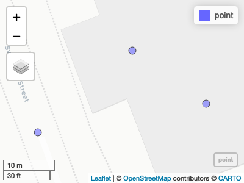
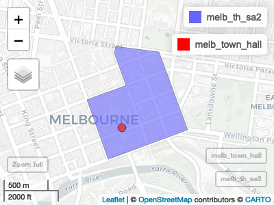

<!-- README.md is generated from README.Rmd. Please edit that file -->

# asgs.geocode

<!-- badges: start -->

[](https://lifecycle.r-lib.org/articles/stages.html#experimental)
[](https://CRAN.R-project.org/package=asgs.geocode)
[](https://github.com/baslat/asgs.geocode/actions/workflows/R-CMD-check.yaml)
<!-- badges: end -->

The goal of asgs.geocode is to be able to take an address and get the
ASGS code for it.

## Installation

You can install the development version of asgs.geocode from
[GitHub](https://github.com/) with:

``` r
# install.packages("pak")
pak::pak("baslat/asgs.geocode")
```

## Basic Example: Address to ASGS

The primary use case of {asgs.geocode} is to go from an address to an
ASGS code. This is done with the `geocode()` and `get_asgs()` functions.

The simplest example is finding the ASGS code for an address or
landmark. Let’s get the 2021 SA2 of Melbourne Town Hall.

``` r
library(asgs.geocode)
## More specific addresses generally perform better
address <- "Melbourne Town Hall, Melbourne"
point <- geocode(address)
point
#> Simple feature collection with 3 features and 6 fields
#> Geometry type: POINT
#> Dimension:     XY
#> Bounding box:  xmin: 144.9664 ymin: -37.8152 xmax: 144.9668 ymax: -37.81506
#> Geodetic CRS:  WGS 84
#>                                                           address rank score
#> 1 Melbourne Town Hall, 100 Swanston St, Melbourne, Victoria, 3000   20   100
#> 2                                             Melbourne Town Hall   22   100
#> 3                                             Melbourne Town Hall   27   100
#>   match_status              type address_type                   geometry
#> 1        match                   PointAddress POINT (144.9666 -37.81506)
#> 2          tie         City Hall          POI  POINT (144.9664 -37.8152)
#> 3          tie Government Office          POI POINT (144.9668 -37.81515)

# It's returned three candidate matches, so let's plot them.
library(mapview)
#> The legacy packages maptools, rgdal, and rgeos, underpinning the sp package,
#> which was just loaded, will retire in October 2023.
#> Please refer to R-spatial evolution reports for details, especially
#> https://r-spatial.org/r/2023/05/15/evolution4.html.
#> It may be desirable to make the sf package available;
#> package maintainers should consider adding sf to Suggests:.
#> The sp package is now running under evolution status 2
#>      (status 2 uses the sf package in place of rgdal)
mapview(point)
#> Google Chrome was not found. Try setting the `CHROMOTE_CHROME` environment variable to the executable of a Chromium-based browser, such as Google Chrome, Chromium or Brave.
```



``` r

# They are all in the same place, so let's just take the one with the best (i.e. lowest) rank.
melb_town_hall <- dplyr::slice_min(point, rank)
melb_town_hall
#> Simple feature collection with 1 feature and 6 fields
#> Geometry type: POINT
#> Dimension:     XY
#> Bounding box:  xmin: 144.9666 ymin: -37.81506 xmax: 144.9666 ymax: -37.81506
#> Geodetic CRS:  WGS 84
#>                                                           address rank score
#> 1 Melbourne Town Hall, 100 Swanston St, Melbourne, Victoria, 3000   20   100
#>   match_status type address_type                   geometry
#> 1        match      PointAddress POINT (144.9666 -37.81506)


# Now we can get the ASGS code for this point.
melb_th_sa2 <- get_asgs(melb_town_hall, "sa2", 2021)
#> Layer Type: Feature Layer
#> Geometry Type: esriGeometryPolygon
#> Service Coordinate Reference System: 3857
#> Output Coordinate Reference System: 4326
melb_th_sa2
#> Simple feature collection with 1 feature and 7 fields
#> Geometry type: POLYGON
#> Dimension:     XY
#> Bounding box:  xmin: 144.9623 ymin: -37.81817 xmax: 144.9749 ymax: -37.80697
#> Geodetic CRS:  WGS 84
#>   objectid shape_length shape_area sa2_code_2021        sa2_name_2021
#> 1      780     4989.981    1286821     206041503 Melbourne CBD - East
#>   overlapping_area overlapping_pct                          geoms
#> 1                0               0 POLYGON ((144.9647 -37.8115...

# And plot the SA2 and the points

mapview(melb_th_sa2) + mapview(melb_town_hall, col.regions = "red")
```



Other years and geographies (and some limited descriptions) are
available with `get_layers()`:

``` r
# See available year-geography layers
layers <- get_layers()
layers
#> # A tibble: 62 × 6
#>       id  year geo   name                description                       url  
#>    <int> <dbl> <chr> <chr>               <chr>                             <chr>
#>  1     0  2016 add   ASGS_2016_ADD_GEN   "Australian Drainage Divisions (… http…
#>  2     1  2016 aus   ASGS_2016_AUS_GEN   ""                                http…
#>  3     2  2016 ced   ASGS_2016_CED_GEN   "Commonwealth Electoral Division… http…
#>  4     3  2016 dzn   ASGS_2016_DZN_GEN   ""                                http…
#>  5     4  2016 gccsa ASGS_2016_GCCSA_GEN "Greater Capital City Statistica… http…
#>  6     5  2016 iare  ASGS_2016_IARE_GEN  "Indigenous Areas are medium siz… http…
#>  7     6  2016 iloc  ASGS_2016_ILOC_GEN  "Indigenous Locations (ILOCs) ar… http…
#>  8     7  2016 ireg  ASGS_2016_IREG_GEN  "Indigenous Regions (IREGs) are … http…
#>  9     8  2016 lga   ASGS_2016_LGA_GEN   "Local Government Areas (LGAs) a… http…
#> 10     9  2016 mb    ASGS_2016_MB_GEN    "Mesh Blocks (MB) are the smalle… http…
#> # ℹ 52 more rows
```
